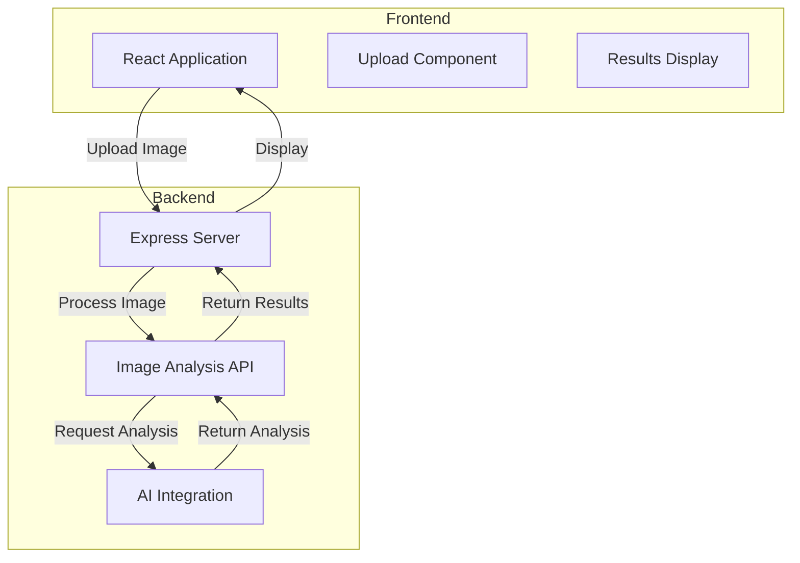
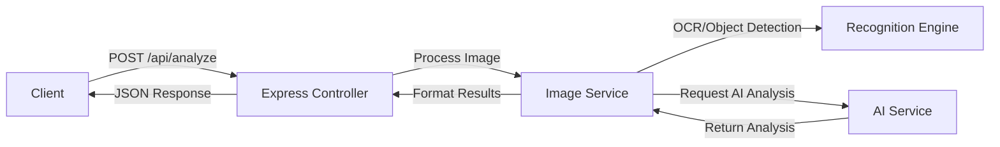

## 1. Architecture Design



## 2. Technology Description
- Frontend: React@18 + TypeScript + tailwindcss@3 + vite
- Initialization Tool: vite-init
- Backend: Express@4 + TypeScript
- 图像识别: Tesseract.js (OCR) 或 视觉模型API
- AI分析: OpenAI API / Claude API (可选)

## 3. Route Definitions
| Route | Purpose |
|-------|---------|
| / | 主页，上传和展示区域 |
| /api/analyze | 图像分析API端点 |

## 4. API Definitions

### 4.1 Request Types
```typescript
interface AnalyzeRequest {
  image: string; // base64 encoded image
}

interface StepAnalysis {
  step: number;
  position: string; // 棋位描述，如"右上角星位"
  reason: string;
  expectation: string;
}

interface AnalyzeResponse {
  success: boolean;
  steps: StepAnalysis[];
  overallAnalysis: string;
  error?: string;
}
```

### 4.2 API Endpoints
- `POST /api/analyze`: 接收上传的图像，返回分析结果

## 5. Server Architecture Diagram



## 6. Data Model
不使用数据库，采用无状态设计
