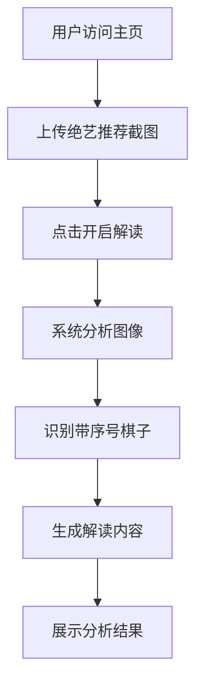

## 1. Product Overview
绝艺推荐解读工具是一个帮助围棋爱好者理解绝艺AI推荐行棋方案的智能分析平台。用户上传绝艺推荐的截图，系统自动识别带有序号的棋子并分析每步棋的意图和棋盘局势。

## 2. Core Features

### 2.1 User Roles
| Role | Registration Method | Core Permissions |
|------|---------------------|------------------|
| 普通用户 | 无需注册 | 上传截图、获取解读结果 |

### 2.2 Feature Module
1. **主页**：截图上传区域、操作按钮、结果展示区域

### 2.3 Page Details
| Page Name | Module Name | Feature description |
|-----------|-------------|---------------------|
| 主页 | 截图上传区 | 支持拖拽和点击上传绝艺推荐截图，支持常见图片格式 |
| 主页 | 操作按钮区 | "开启绝艺推荐解读"按钮，点击后触发分析 |
| 主页 | 结果展示区 | 展示分析结果，包括各步棋的解读和总体局势分析 |

## 3. Core Process
用户访问主页 → 上传绝艺推荐截图 → 点击"开启绝艺推荐解读" → 系统分析并生成解读 → 展示分析结果

## 4. User Interface Design
### 4.1 Design Style
- 主色调：深木色（#5D4037）和象牙白（#FAF8F5），呼应围棋棋盘的传统美学
- 辅助色：金色（#FFC107）作为强调色，用于序号标记
- 按钮风格：圆角矩形，带有轻微阴影，悬停时有缩放效果
- 字体：标题用Playfair Display（优雅的衬线字体），正文用Noto Sans SC（清晰易读）
- 布局风格：卡片式布局，左侧上传区，右侧结果区
- 图标风格：使用线条简洁的SVG图标，符合围棋的极简美学

### 4.2 Page Design Overview
| Page Name | Module Name | UI Elements |
|-----------|-------------|-------------|
| 主页 | 截图上传区 | 虚线边框的拖拽区域，带有上传图标，上传后显示预览 |
| 主页 | 操作按钮区 | 大号金色按钮，带有围棋棋子图标 |
| 主页 | 结果展示区 | 分步骤展示的卡片，带有折叠/展开动画 |

### 4.3 Responsiveness
- Desktop-first 设计，自适应平板和移动设备
- 在小屏幕上采用垂直布局，先展示上传区再展示结果区
- 触摸优化，按钮尺寸适合手指点击

### 4.4 3D Scene Guidance
不适用
